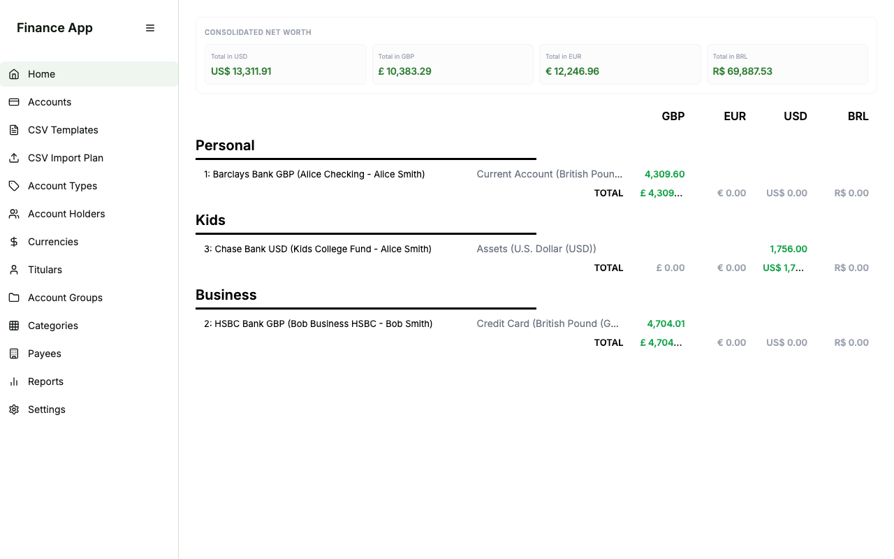
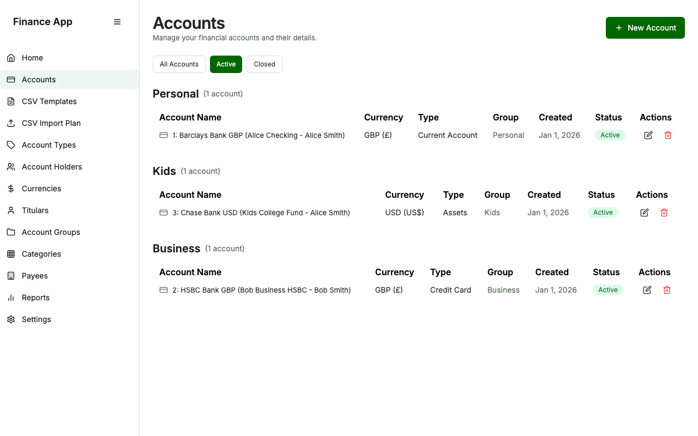
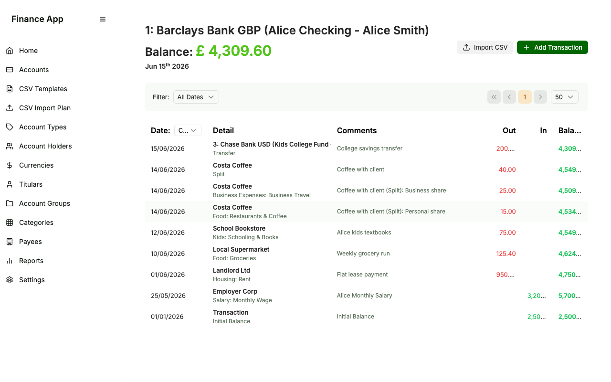
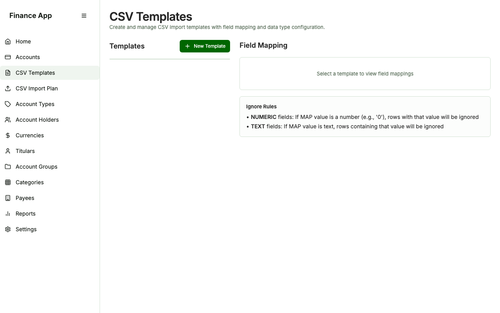
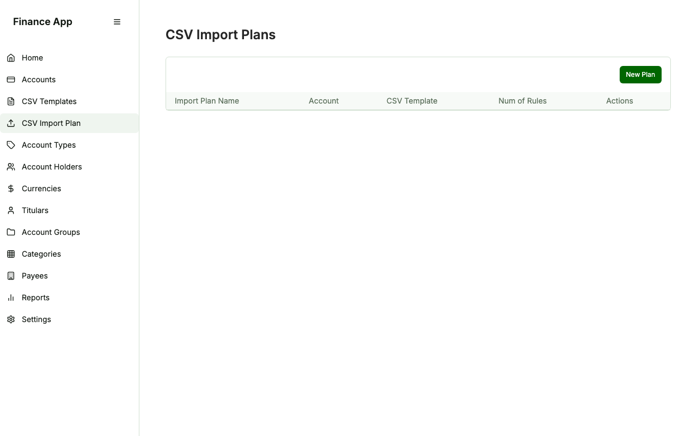
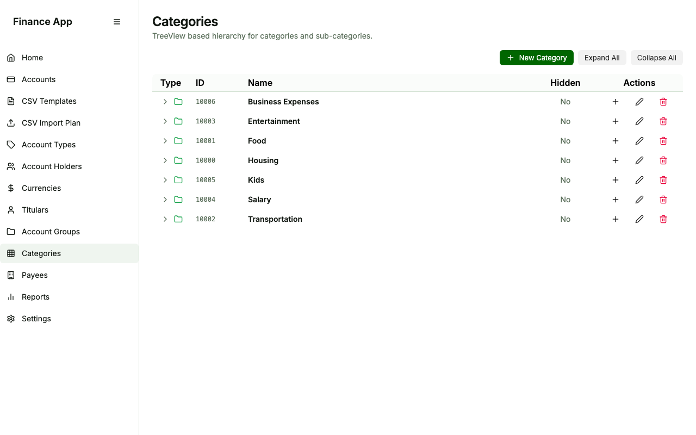
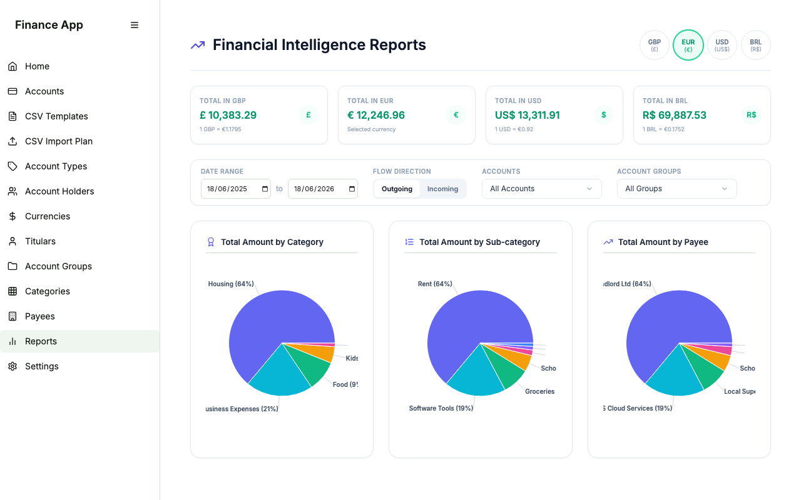
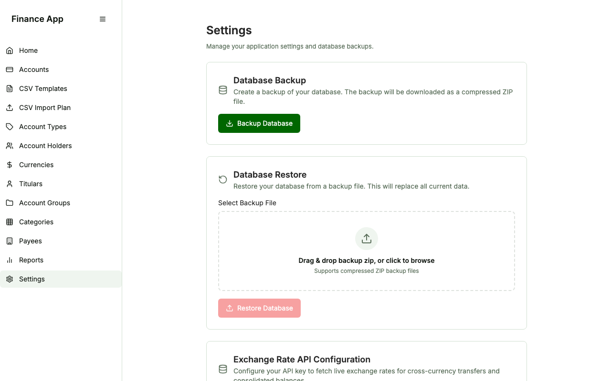

# Finance App

A comprehensive, self-hosted, multi-currency double-entry personal finance tracking and management system. Designed for high performance and clean accounting boundaries, it supports automated rule-based CSV ingestion, rich transactional ledgers, cross-currency transfers, interactive reports, and localized database management.

---

## Features

- **Consolidated Net Worth**: Dynamic net worth aggregation across all accounts with automated currency conversions.
- **Multi-Currency Ledgers**: Full native support for accounts in GBP, USD, EUR, and more, powered by live exchange rate integrations.
- **Advanced Transactions**:
  - Deposits & Withdrawals.
  - Cross-currency transfers with dynamic conversion rate overrides.
  - Split transactions (splitting a single expense across multiple categories).
- **Automated CSV Ingestion**: Define custom CSV templates and Import Plans with rule-based mappings (regex/substring) to auto-categorize and clean imported transaction history.
- **Hierarchical Categories**: Multi-level category tree with structural CRUD actions and a category merge/cleanup utility.
- **Interactive Reports**: High-fidelity data visualizations including net worth trends, category breakdown charts, and transactional cashflow analysis.
- **Robust Database Management**: Native SQL schema backed by PostgreSQL, with built-in Settings to backup, restore, reset, or seed sample financial data.

---

## Visual Tour

### 1. Dashboard / Home
Consolidated net worth overview, account-group hierarchies (Personal, Kids, Business), and current balances.


### 2. Accounts Management
Manage checking accounts, savings portfolios, credit cards, assets, and liabilities.


### 3. Account Ledger (Transactions)
Detailed transactional records supporting deposits, withdrawals, transfers, splits, and reconciling states (Clear, Reconciled, Unclear).


### 4. CSV Templates
Define reusable templates matching columns from any bank's CSV export files.


### 5. CSV Import Plans
Automated transformation rules to auto-assign Payees, Categories, and Titulars during CSV uploads.


### 6. Categories Hierarchy
Organize your expenses and incomes in a tree structure. Clean up duplicates using the built-in Category Merge feature.


### 7. Interactive Reports
Analyze spending patterns and net worth growth through interactive charts.


### 8. System Settings
Export full database backups as compressed ZIP files, restore previous states, adjust Exchange Rate API keys, or load sample datasets.


---

## Technology Stack

- **Frontend**: React, Vite, TypeScript, Tailwind CSS, GravityUI, Lucide Icons.
- **Backend**: FastAPI (Python), SQLAlchemy, Pydantic, Uvicorn.
- **Database**: PostgreSQL (18-alpine).
- **Containerization**: Docker, Docker Compose.
- **Testing**: PyTest (Backend), Playwright (E2E Integration).
- **Package Managers**: Astral `uv` (Python), `npm` (Node).

---

## Quick Start (Production Setup)

### Prerequisites
Make sure you have [Docker](https://www.docker.com/get-started) and [Docker Compose](https://docs.docker.com/compose/install/) installed.

### 1. Download/Clone the Project
Clone the repository to your local machine:
```bash
git clone https://github.com/your-username/finance-app.git
cd finance-app
```

### 2. Launch the Application
Run Docker Compose in detached mode to download dependencies, build the containers, and start the services:
```bash
docker compose up -d --build
```
This command spins up three services:
1. **db**: PostgreSQL database server listening internally on port 5432 (mapped to host port `5433` for local diagnostics).
2. **backend**: FastAPI web server running on port `8000`.
3. **frontend**: Vite static build served via Nginx on port `3000`.

### 3. Access the Application
Once the containers are healthy, open your web browser and navigate to:
- **Web App**: [http://localhost:3000](http://localhost:3000)
- **API Swagger Docs**: [http://localhost:8000/docs](http://localhost:8000/docs)

To stop the services, run:
```bash
docker compose down
```

---

## Brief Tutorial: How to Use

### 1. Seeding Sample Data
To test the system immediately with realistic financial history:
1. Go to the **Settings** menu in the sidebar.
2. Under **Database Reset**, click **Load Sample Database**.
3. Confirm by clicking **Yes, Load Sample Database**.
4. The system will delete any current database, recreate all tables, seed them, and present you with rich, pre-configured charts, accounts, and ledger entries.

### 2. Creating an Account
1. Navigate to **Accounts** and click **New Account**.
2. Fill in the Owner (Titular), Financial Institution (Account Holder), Name, Currency, and Initial Balance.
3. Click **Create**.

### 3. Adding Transactions & Transfers
- **Manual Input**: Click **New Transaction** inside any account ledger. You can choose a simple Deposit/Withdrawal, or select **Transfer** to move funds to another account (with automatic exchange rate calculation if currencies differ).
- **Split Expense**: Inside the transaction dialog, click **Add Split** to break down a single receipt (e.g., a supermarket bill) into different categories.

### 4. Importing Bank CSVs
1. Go to **CSV Templates** and create a template specifying your bank's column indexes (e.g., Date at index 0, Payee at index 2, Amount at index 4).
2. Navigate to **CSV Import Plan** and create a plan mapping matching rules. (For example: If description contains "Netflix", auto-assign Payee "Netflix" and Category "Entertainment -> Streaming Services").
3. Click **Upload** inside your Account Ledger, select your template, choose your plan, upload the CSV, and review/edit the transaction grid before finalizing the import.

---

## Local Development & Testing

If you want to run the project locally without Docker or run tests:

### Backend Setup
The backend uses Astral `uv` for dependency management.
```bash
cd backend
# Create virtual env & install dependencies
uv venv
source .venv/bin/activate
uv sync

# Run the dev server
uvicorn app.main:app --reload --port 8000
```

### Frontend Setup
```bash
cd frontend
npm install
npm run dev -- --port 3000
```

### Running Tests
To run database schema setup, backend unit tests, and the headed E2E Playwright suite automatically, run:
```bash
./run-tests.sh
```

---

## TODOS

- User Login
- Reports are not working and it need more dasboards

## License

This software is released under a custom open source license. See the [LICENSE](LICENSE) file for the full license terms and conditions.
